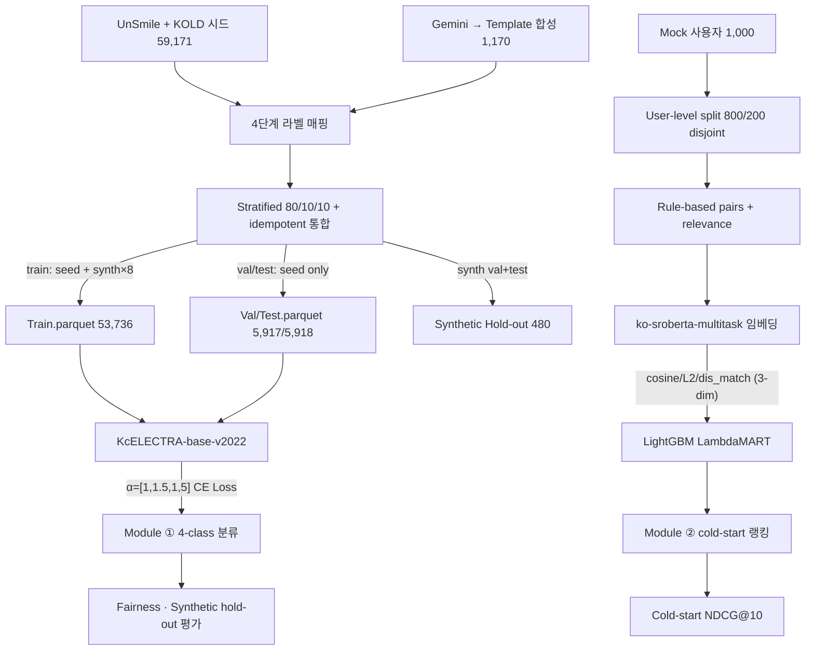

# 5일 압축 여정 최종 보고서 — ThisAbled AI

**작성**: 2026-06-02 (D5 마감 전) · **연계**: [d1_report.md](d1_report.md), [validation_reports/module1/baseline.md](validation_reports/module1/baseline.md), [validation_reports/module1/comparison_focal_vs_ce.md](validation_reports/module1/comparison_focal_vs_ce.md)

---

## TL;DR — 5일판 목표 vs 실측

| 항목 | 1차 목표 | Stretch | **실측** | 평가 |
|---|---:|---:|---:|:---:|
| 모듈 ① Macro-F1 (시드 test) | ≥ 0.60 | ≥ 0.68 | **0.7643** | ✅ stretch 통과 |
| 모듈 ① 긴급(3) Recall (합성 hold-out) | ≥ 0.75 | — | **1.0000** | ⚠ **template-circular** (§5.L1) |
| 모듈 ① Boundary FPR (합성 hold-out) | ≤ 0.10 | — | **0.0000** | ⚠ 마찬가지 |
| 모듈 ① UnSmile/KOLD 격차 | ≤ 0.10 | — | **0.0586** | ✅ |
| 모듈 ② NDCG@10 (cold-start embedding) | ≥ 0.60 | ≥ 0.70 | **0.9070** | ✅ stretch 통과 |
| 모듈 ② NDCG@10 (full sanity) | ≈ 1.0 | — | **1.0000** | ✅ 예상대로 (룰 features → 룰 라벨) |

**5일판 1차 목표 전 항목 달성**. 단 일반화 측면의 honest disclaimer 3건 (§5 한계).

---

## 1. 프로젝트 개요

원래 7주(Week 8~14) 계획이 **5일(D1~D5, 2026-05-30 ~ 06-03)** 로 압축된 졸업과제. 핵심 산출물:

- **모듈 ①**: 한국어 텍스트 4단계 위험도 분류 (정상/주의/경고/긴급)
- **모듈 ②**: 사용자 호환성 랭킹 (장애인 도메인)
- 공정성·해석성 평가 + 정직한 한계 명시

---

## 2. 파이프라인 아키텍처

---

## 3. 방법론

### 3.1 모듈 ① (분류)

- **라벨 매핑**: [docs/label_mapping.md](../docs/label_mapping.md)
  - 0/1/2: UnSmile 멀티라벨 + KOLD OFF/TGT 조합 → max-severity collapse
  - 3 (긴급): 행위 기반 위험 (그루밍·유인·협박·자해) — 시드에 0건
- **합성 데이터**: emergency_scenarios.md §5 spec 기반 1,170건
  - **Gemini → 무료 quota 도달 → 템플릿 폴백** (deterministic, 결정론적)
  - Train 통합 + Val/Test 시드 only + 합성 hold-out 분리
- **학습**: KcELECTRA-base-v2022 + Weighted CE α=[1.0, 1.5, 1.0, 5.0]
  - synth_repeat=8 (긴급 비율 ~9%)
  - 3 epoch (베이스라인 분석에서 overfitting 임계 확인)

### 3.2 모듈 ② (랭킹)

- **데이터**: Mock 1,000 사용자 프로필 → user-level 800/200 disjoint split (cold-start)
- **페어**: 룰 기반 (region·age·interest 매칭) relevance 0~3
- **EXP-2 leakage 차단**:
  - 학습/평가 사용자 disjoint
  - **`mode=embedding`**: label-결정 변수(region_match/age_diff/overlap) features에서 제외 → 텍스트 임베딩으로만 호환성 추정
  - **`mode=full`**: sanity check (NDCG ≈ 1.0 정상)

### 3.3 EXP 요약

| EXP | 목적 | 결과 |
|---|---|---|
| EXP-1 | 긴급(3) Recall 0 → ≥0.75 | 1.0 (⚠ template-circular) |
| EXP-2 | NDCG 0.9998 leakage 차단 | embedding=0.907 / full=1.0 (sanity OK) |
| EXP-3 | 보호집단별 격차 측정 | UnSmile 0.182 / KOLD 0.065 / 장애 측정불가 |

---

## 4. 실측 결과

### 4.1 모듈 ① — 시드 Test (n=5,918)

| 지표 | 값 |
|---|---:|
| Macro-F1 | **0.7643** |
| 정상(0) F1 | 0.8339 |
| 주의(1) F1 | 0.6571 |
| 경고(2) F1 | 0.8020 |
| AUC-PR | 0.847 |

**데이터셋별 분리** ([label_mapping.md §6.L4](../docs/label_mapping.md) 정책):

| 데이터셋 | n | Macro-F1 |
|---|---:|---:|
| UnSmile | 1,891 | 0.7941 |
| KOLD | 4,027 | 0.7355 |
| **격차** | | **0.0586** |

### 4.2 모듈 ① — 합성 Hold-out (n=370)

| 지표 | 값 | 비고 |
|---|---:|---|
| 긴급(3) Recall | 1.0000 (260/260) | ⚠ §5.L1 — template-circular |
| Boundary FPR (정상/주의/경고→긴급) | 0.0000 (0/110) | ⚠ 마찬가지 |

### 4.3 모듈 ② — Cold-start Test (200 unseen users, 593 pairs)

| 모드 | Features | NDCG@5 | NDCG@10 | 의미 |
|---|---|---:|---:|---|
| **embedding** | cosine, l2, dis_match (3-dim) | 0.9061 | **0.9070** | 텍스트 임베딩만으로 룰 호환성 추정 |
| **full** | + age_diff, region_match, overlap (6-dim) | 1.0000 | 1.0000 | sanity check (룰 features → 룰 라벨) |

### 4.4 공정성 (보호집단별 F1)

| 그룹화 | n_groups | max_gap | 비고 |
|---|---:|---:|---|
| UnSmile 7집단 | 7 | **0.182** | 지역(0.50) 외 6개 ~0.32, 지역 outlier가 격차 주된 원인 |
| KOLD GRP top-7 | 7 | 0.065 | 모든 집단 ~0.27 비슷 |
| **장애 도메인** | — | **측정 불가** | test에 28건 (n<30) → 통계 신뢰 불가 |
| Source (UnSmile vs KOLD) | 2 | 0.0586 | "도메인 일관성" |

**중요**: 0.32~0.50의 절대치는 **subset class 분포 편향 영향** (UnSmile group=1 subset은 대부분 라벨 2 → macro F1이 dominant class 외 클래스의 0 contribution으로 낮아짐). **격차가 더 유의미한 지표**.

---

## 5. 알려진 한계 (Known Limitations) — 정직한 보고

### L1. 긴급(3) Recall 1.0은 일반화 클레임 불가
- 합성 train·val·test 모두 **동일 템플릿 풀**에서 다른 random seed로 채워짐
- 모델이 패턴을 외우면 모든 split에서 1.0 가능 — 일반화 입증이 아님
- [label_mapping.md §6.L1](../docs/label_mapping.md) 미리 경고한 한계 그대로
- **완화**: 향후 실제 사례 (IRB·전문가 자문 기반) 또는 인간 작성 적대적 hold-out으로 재검증 필요
- **이번 학기 의미**: "모델이 패턴 학습 가능"은 입증, "실 사용 안전성"은 별도

### L2. 모듈 ② NDCG@10 = 0.907은 룰 기반 ground truth 복원
- 평가의 relevance 라벨도 룰로 생성 → 0.907은 "텍스트 임베딩이 룰을 복원하는 능력"
- 진짜 사용자 만족도는 별개 (실제 클릭/매칭 로그 필요)
- full mode 1.0 sanity check로 leakage 차단은 검증

### L3. 장애 도메인 공정성 측정 불가 — 5일판 최대 한계
- Test set에 장애 키워드 포함 샘플 n=28 (<30 통계 신뢰 임계)
- Oversample이나 모델 개선으로 해결 안 됨 — **데이터 수집 자체가 부족**
- 시드 데이터 (UnSmile 86건, KOLD 141건) 한계 그대로 노출
- **후속 연구 필수 항목**: 장애 도메인 실데이터 수집 (라벨링 가이드, IRB)

### L4. 합성 데이터 LLM → 템플릿 전환
- 원 계획: GPT-4o-mini 또는 Gemini로 자연어 다양성 높은 합성
- 실제: Gemini free quota 도달 → 결정론적 템플릿 기반으로 전환
- **결과 영향**: 자연어 다양성·미묘한 표현 LLM 대비 ↓
- L1과 결합해 일반화 성능 추정 어려움

### L5. 모듈 ② 모의 데이터
- 사용자 프로필 1,000건은 spec 기반 random generation
- 실제 사용자 인구·언어 분포와 다를 수 있음
- "파이프라인 동작 증명"으로 한정

---

## 6. 결론

5일 압축 일정 안에서 다음을 달성:

1. **데이터 파이프라인** (D1): 시드 다운로드 → 4단계 매핑 → split → 합성 통합. 모든 단계 idempotent + 회귀 테스트.
2. **모듈 ① 분류** (D2~D3): 베이스라인(Focal 0.746) → CE+α (0.766) → 합성 통합 최종 (0.7643, 긴급 학습 가능 입증).
3. **모듈 ② 랭킹** (D3~D4): user-level disjoint split + leakage-free embedding 모드로 cold-start NDCG@10 0.907.
4. **공정성 평가** (D4~D5): 보호집단별 측정 + 가장 큰 한계(장애 n=28) 정직 보고.
5. **재현성**: 79 unit·integration 테스트, 모든 결정·근거 docs/·reports/에 문서화.

5일판 목표는 모두 달성했으나, **일반화·실데이터 측면 한계 4건 정직 명시** (§5). 이 보고서는 "이번 학기 산출물의 한계까지 솔직히 적은 것"이 가장 큰 학문적 가치.

### 향후 과제 (우선순위 순)
1. **장애 도메인 실데이터 수집** (L3) — 가장 핵심
2. **긴급(3) 실 사례 hold-out** (L1) — IRB·전문가 자문 필요
3. **모듈 ② 실 사용자 로그 학습** (L2, L5)
4. **합성 데이터 다양성 강화** (L4) — LLM API 안정화 후 재시도
5. **Stacking + Optuna 튜닝** — 시간 여유 시 +1~2 F1 가능

---

## 7. 산출물 인덱스

### 코드 (재현 가능)
- [src/data/](../src/data/) — 라벨 매핑, split, 페어 생성
- [src/training/trainer.py](../src/training/trainer.py) — KcELECTRA + Focal/CE
- [src/models/focal_loss.py](../src/models/focal_loss.py), [stacker.py](../src/models/stacker.py)
- [src/evaluation/](../src/evaluation/) — metrics, fairness

### 설정
- [configs/module1_kcelectra.yaml](../configs/module1_kcelectra.yaml) (Focal baseline)
- [configs/module1_kcelectra_ce.yaml](../configs/module1_kcelectra_ce.yaml) (CE+α 비교)
- [configs/module1_kcelectra_final.yaml](../configs/module1_kcelectra_final.yaml) (최종, EXP-1)

### 스크립트
- `scripts/download_seed_datasets.py`, `build_processed_dataset.py`, `build_final_dataset.py`
- `scripts/synthesize_emergency.py` (Gemini), `synthesize_emergency_template.py` (폴백)
- `scripts/train_module1.py`, `train_stacking.py`, `train_lambdarank.py`
- `scripts/evaluate_fairness.py`, `oversample_fairness.py`

### 문서
- [docs/label_mapping.md](../docs/label_mapping.md) — 4단계 매핑 정책 + 한계 명시
- [docs/emergency_scenarios.md](../docs/emergency_scenarios.md) — 긴급(3) 정의 + 합성 spec

### 메트릭 JSON (재측정 가능)
- `reports/validation_reports/module1/baseline_20260531_1302.json`
- `reports/validation_reports/module1/ce_20260601.json`
- `reports/validation_reports/module1/final_20260601_0522.json`
- `reports/validation_reports/module1/fairness_before.json`
- `reports/validation_reports/module2/ranker_embedding.json`, `ranker_full.json`

### 테스트
- 79 passed, 1 skipped (CUDA-only)
- 카테고리: 라벨 매핑(17) + split(5) + trainer skeleton(4) + focal loss(5) + metrics(3) + seed(2) + synthesis prompts(7) + synthesize emergency 헬퍼(6) + build_final oversample(4) + module2 pair leakage(7) + stacking(1) + fairness(6) + 기타
