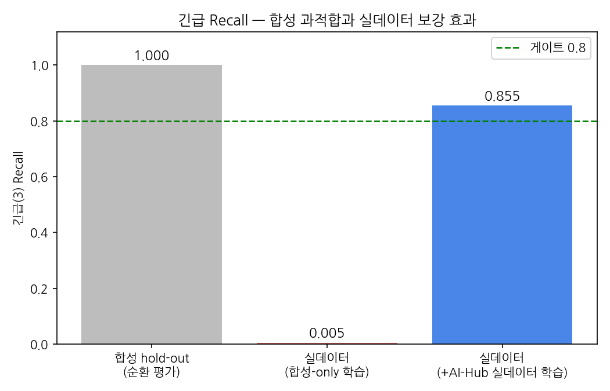
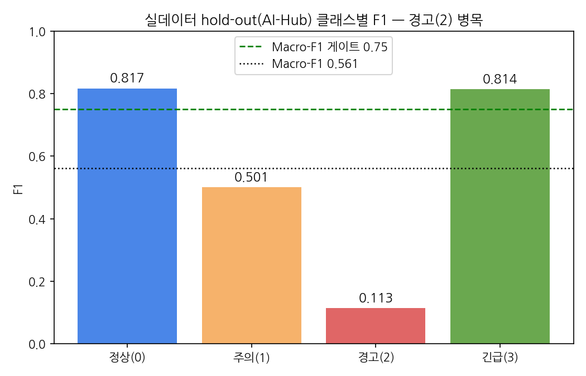

# ThisAbled AI — 최종 결과 보고서 (Present Results)

**작성일**: 2026-06-10 · **브랜치**: `fix/d3-leakage-reproducibility`
**대상**: 모듈① 안전 감시(4단계 위험도 분류) · 모듈② 그룹 매칭(Two-Tower 랭킹)
**근거 데이터**: MLflow run + `reports/validation_reports/**` JSON (실데이터 hold-out, 비순환)
**판정 기준**: `project_facts.md` 최종 합격 게이트 / `step6_present_results.md`

---

## 0. 한 줄 결론

**조건부 GO.** 본 과제의 **주 KPI인 긴급 미탐 최소화(Recall ≥ 0.80)를 실데이터에서 0.855로 충족**했고, 핵심 리스크였던 **합성 과적합을 진단·해소**(합성↔실 갭 0.995→0.145)했다. 다만 **부 KPI인 Macro-F1(≥0.75)은 0.561로 미달**(경고·주의 클래스 약점). 모듈②는 mock 데이터 기반 **합성 타당성** 수준에서 게이트를 통과한다.

---

## 1. Problem

장애인 소셜 플랫폼의 두 예측 문제: **① 텍스트 위험도 4단계 분류**(정상/주의/경고/긴급, 긴급 미탐 최소화가 안전상 최우선), **② 사용자 그룹 매칭**(상위-K 추천 품질). 합격 게이트(`project_facts.md`): 긴급 Recall ≥ 0.80, Macro-F1 ≥ 0.75, NDCG@10 ≥ 0.70, Demographic Parity diff ≤ 0.10, CPU 추론 < 100ms.

핵심 난점은 **긴급 클래스의 실데이터 희소성**이다. 공개 시드(UnSmile/KOLD)에는 긴급이 없어 LLM 합성으로 보강했는데, 이때 **"합성으로 학습→합성으로 평가"하는 순환 평가가 거짓 성공을 만들 위험**이 본 과제의 중심 리스크였다.

## 2. Method

### 2.1 재현성·누수 차단 인프라 (D-3)
- `seed=42` 고정. 모든 run **MLflow 자동 로깅**.
- 시드↔합성 **MinHash 중복 제거**(`dedup.py`)로 데이터 누수 차단.
- Stacking은 **OOF(out-of-fold) logits**만 사용해 in-fold 누수 제거(`generate_oof_logits.py`).
- 채점은 **긴급(3) 포함 4-class 고정**(`metrics.py`) — 긴급이 평가셋에 0건이면 macro-F1에서 조용히 빠지던 누락 버그를 차단.

### 2.2 비순환 실데이터 평가 (D-2)
- **긴급 평가 = AI-Hub 「텍스트 윤리검증 데이터」 실긴급 hold-out**(3,991행, 긴급 1,501). train에 쓰인 합성과 분리, **conv_id 기준 train과 완전 분리** + 텍스트 MinHash 중복 제거(겹침 0 검증).
- **0/1/2 교차도메인 = BEEP(Korean HateSpeech)** hold-out(1,500행, None/Offensive/Hate→0/1/2).
- 학습=합성+실데이터 / 평가=분리된 실데이터 → **합성→실데이터 일반화**를 직접 측정.

### 2.3 학습 데이터 구성 (최종)
`train = 시드(UnSmile+KOLD 47,336) + 합성 긴급(800×8=6,400) + AI-Hub 실데이터(19,977, hold-out conv 배제)` = **73,713행, 긴급 비율 17.4%**. val/test는 오염 방지로 시드만 유지(긴급 0건 → 학습 모니터 용도).
모델: `beomi/KcELECTRA-base-v2022` + Weighted CE(α=[1,1.5,1,1]), 3 epoch.

## 3. Result

### 3.1 모듈① — 합성-only vs 실데이터 투입 (핵심 발견)

| 지표 (AI-Hub 실데이터 hold-out, n=3,991) | 합성-only | **+ AI-Hub 실데이터** | 게이트 |
|---|---:|---:|---|
| **긴급 Recall** | 0.0047 | **0.8548** | ≥0.80 ✅ |
| Macro-F1 (4-class) | 0.303 | 0.561 | ≥0.75 ❌ |
| 합성↔실 긴급 Recall 갭 | +0.995 | **+0.145** | (작을수록 좋음) |

→ **합성-only 모델은 실긴급을 사실상 못 잡았고(0.5%), 실데이터 투입이 이를 0.855로 끌어올렸다.** 합성 과적합이 실데이터 보강으로 해소됨을 정량적으로 입증.

> 합성 hold-out(순환 평가)의 1.00은 "거짓 성공"이다. 같은 모델이 비순환 실데이터에선 0.005에 그쳤고(합성-only 학습), 실데이터를 train에 넣자 0.855로 게이트(0.80)를 넘었다.

### 3.2 모듈① 클래스별 (실데이터 hold-out, 최종 모델)

| 클래스 | Precision | Recall | F1 | Support |
|---|---:|---:|---:|---:|
| 0 정상 | 0.873 | 0.767 | 0.817 | 1,475 |
| 1 주의 | 0.471 | 0.535 | 0.501 | 832 |
| 2 경고 | 0.162 | 0.087 | **0.113** | 183 |
| 3 긴급 | 0.777 | **0.855** | 0.814 | 1,501 |

→ 긴급·정상은 강함(F1 0.81+). **Macro-F1을 끌어내리는 병목은 경고(2) F1 0.11**(AI-Hub에 희소: 전체 21k, train 투입 650건)과 주의(1) 0.50.

### 3.3 모듈① Stacking
OOF 누수 제거 후 LightGBM Stacking은 base 단일 모델 대비 **향상 ≈0**(이전 run에서 4-class macro Δ≈−0.0004). → `project_facts` 백업 규칙에 따라 **복잡한 Stacking 대신 단일 모델 채택**이 합리적. (단 본 실데이터 모델에서의 stacking 재평가는 미수행 — 한계로 명시.)

### 3.4 모듈② 매칭 (mock 데이터)

| 지표 | 값 | 게이트 |
|---|---:|---|
| NDCG@10 (embedding) | 0.907 | ≥0.70 ✅ |
| Demographic Parity diff (장애유형) | 0.0808 | ≤0.10 ✅ |
| 같은장애 vs 다른장애 top-K율 | 0.5013 vs 0.5000 | (편향 거의 없음) |

`full` 모드 NDCG=1.0은 **라벨 결정변수를 피처로 넣은 sanity check**이며 결과가 아니다. 장애유형별 선택률 격차 8.1%p로 DP 게이트 통과.

### 3.5 운영 제약
- **CPU 단건 추론 median 46.7ms** (1-thread, Apple Silicon) < 100ms ✅. 배포 대상 x86 CPU 재확인 권장.

### 3.6 최종 게이트 스코어보드

| 게이트 | 기준 | 결과 | 판정 |
|---|---|---:|---|
| 긴급 Recall (①, 실데이터) | ≥0.80 | 0.855 | ✅ |
| Macro-F1 (①, 실데이터) | ≥0.75 | 0.561 | ❌ |
| NDCG@10 (②, mock) | ≥0.70 | 0.907 | ✅* |
| Demographic Parity (②, mock) | ≤0.10 | 0.081 | ✅* |
| CPU 추론 | <100ms | 47ms | ✅ |

\* mock 데이터 기반 — 합성 타당성 수준.

## 4. Discussion

### 4.1 핵심 성과 — 안전 KPI 달성 + 과적합 진단
본 과제의 주 KPI는 "긴급 미탐 최소화"다. **실데이터에서 긴급 Recall 0.855**로 이를 충족했고, 더 중요하게는 **순환 평가가 가렸던 합성 과적합(실 Recall 0.005)을 비순환 hold-out으로 드러내고, 실데이터 보강으로 해소**(0.855)했다. "합성만으로는 안 되고 실데이터가 필요하다"는 결론은 본 연구의 가장 견고한 발견이다.

### 4.2 미달 — Macro-F1과 클래스 불균형
Macro-F1 0.561(< 0.75)의 병목은 **경고(2)**다(F1 0.11). AI-Hub의 경고 라벨이 희소(전체의 5%)하고 train 투입분도 650건에 그쳤다. 주의(1)도 0.50으로 경계가 모호하다. 즉 **균형 정확도는 데이터 불균형·라벨 경계 문제**이지 모델 구조 문제가 아니다.

### 4.3 한계 (은폐 없이)
1. **모듈② 전면 mock**: 실 사용자/매칭 데이터가 없어 NDCG·DP 모두 합성 타당성 수준. 실서비스 일반화는 미검증.
2. **모듈① 인구통계 공정성 미측정**: AI-Hub hold-out에 장애유형/성별/연령 태그가 없어 집단별 Recall 격차(<10%p)를 측정하지 못함. (위험 클래스별 Recall만 보고.)
3. **도메인 갭**: train은 뉴스/SNS 댓글 + AI-Hub, BEEP 교차도메인 0/1/2 macro 0.41 — 도메인 전이 여지 있음.
4. **SMOTE·Optuna 미적용**: 불균형 보정·하이퍼파라미터 최적화는 미수행(후속).
5. **Stacking 실데이터 재평가 미수행**.

## 5. Decision & Next Steps

### 판정: **조건부 GO**
- **주 KPI(긴급 Recall 0.855 ≥ 0.80) 충족** + 합성 과적합 해소 → 안전 감시 모듈의 핵심 목적은 실데이터에서 작동함이 입증됨. **계속 진행 정당.**
- 단 **부 KPI(Macro-F1 0.561 < 0.75) 미달**이라 무조건 GO는 아니며, 아래 보완이 전제.

### 우선순위
1. **경고(2)·주의(1) 강화** — AI-Hub 경고 실데이터 추가 확보/오버샘플, 라벨 경계 재검토(주의↔경고). Macro-F1 게이트 재도전.
2. **모듈① 인구통계 공정성** — 그룹 태그 있는 hold-out 구성해 집단별 Recall 격차 측정.
3. **모듈②** — 실 매칭 데이터 확보(불가 시 백업안: SBERT+LogReg 최소실험으로 축소, 보고서에 mock 타당성으로 명시).
4. **운영** — 배포 CPU 추론시간 재확인, SMOTE/Optuna 적용 검토.

### 재현
`scripts/run_full_pipeline.sh`(또는 `notebooks/04_run_full_pipeline.ipynb`) + `--include-aihub-train`. seed=42, MLflow 로깅, 평가셋은 `data/eval/*.jsonl`로 커밋되어 clone만으로 재현 가능.
