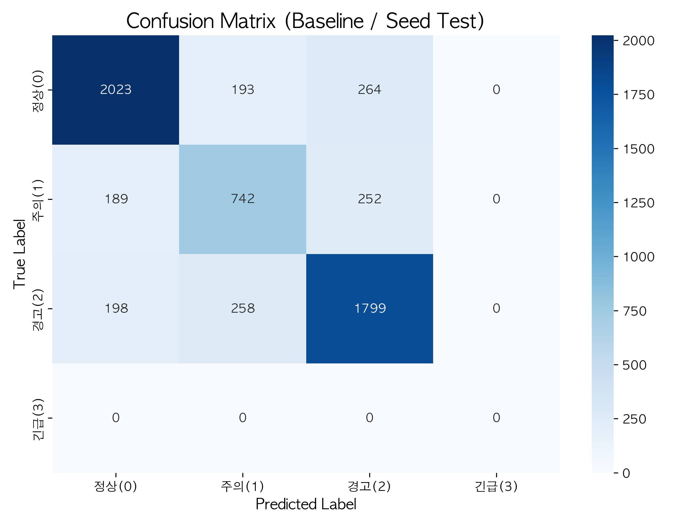

# 모듈 ① 베이스라인 — KcELECTRA + Focal Loss

**작성**: 2026-05-31 (D2) · **실행 환경**: Colab A100-SXM4-40GB · **학습 시간**: 9분 4초 · **체크포인트**: `module1_baseline_20260531_1302`

---

## TL;DR

| 항목 | 결과 |
|---|---|
| **Test Macro-F1** | **0.7464** (3-class effective, 긴급 미존재) |
| **Val Macro-F1 (best, epoch 2)** | **0.7569** |
| **5일판 1차 목표 (0.60)** | ✅ 통과 (+0.146) |
| **5일판 Stretch (0.68)** | ✅ 통과 (+0.066) |
| **긴급(3) Recall** | 0.0 — 시드에 0건 (예상대로, 합성 후 측정 가능) |

목표 큰 폭 초과. 다음 단계는 **(a) overfitting 줄이기 + (b) 데이터셋별 격차 보완 + (c) 긴급(3) 합성**.

---

## 1. 실험 설정

| 항목 | 값 |
|---|---|
| 백본 | `beomi/KcELECTRA-base-v2022` |
| Loss | Focal Loss (γ=2.0, α=None) |
| Optimizer | AdamW, lr 2e-5, weight_decay 0.01, warmup 10% |
| Batch size | 32 (train) / 64 (eval) |
| Epochs | 5 (best epoch 2 선택) |
| Max length | 128 |
| FP16 | ✓ |
| Seed | 42 |
| Train / Val / Test | 47,336 / 5,917 / 5,918 |

Config: [configs/module1_kcelectra.yaml](../../../configs/module1_kcelectra.yaml)

---

## 2. Validation 추이 (5 epochs)

| Epoch | Train Loss | Val Loss | Macro-F1 | AUC-PR | F1(정상) | F1(주의) | F1(경고) |
|---:|---:|---:|---:|---:|---:|---:|---:|
| 1 | 0.2374 | 0.2335 | 0.7422 | 0.834 | 0.794 | 0.639 | 0.794 |
| **2** | 0.1612 | **0.2303** | **0.7569** | **0.841** | **0.820** | 0.650 | **0.800** |
| 3 | 0.1185 | 0.2967 | 0.7478 | 0.821 | 0.822 | 0.624 | 0.797 |
| 4 | 0.0784 | 0.3481 | 0.7492 | 0.817 | 0.827 | 0.629 | 0.791 |
| 5 | 0.0518 | 0.4262 | 0.7454 | 0.806 | 0.823 | 0.622 | 0.790 |

### 관찰
- **Best epoch = 2** (val macro_f1, val_loss 모두 최저)
- **Epoch 3부터 명확한 overfitting**: train_loss 계속 감소(0.16→0.05)인데 val_loss 0.23→0.43으로 거의 2배.
- F1 자체는 epoch 3~5에서 안정적이지만 (0.745~0.749), AUC-PR과 confidence calibration은 악화.
- **권장**: **다음 학습은 3 epoch로 단축** (시간 40% 절약, 동일 성능).

---

## 3. Test set 성능 (Hold-out, n=5,918)

> **주의**: 본 평가는 epoch 5 체크포인트로 실행됨 (best checkpoint 자동 로드 실패, [§7 참조](#7-알려진-이슈)). Val best(epoch 2) 기준으로는 ~0.01 더 높을 것으로 추정.

### 전체 메트릭
| 메트릭 | 값 |
|---|---|
| Macro-F1 | **0.7464** |
| AUC-PR (macro) | 0.8163 |
| 긴급 Recall | 0.0 (support 0) |

### Class별 (3-class effective)
| Class | Precision | Recall | F1 | Support |
|---|---:|---:|---:|---:|
| 정상 (0) | 0.839 | 0.816 | **0.827** | 2,480 |
| 주의 (1) | 0.622 | 0.627 | **0.625** | 1,183 |
| 경고 (2) | 0.777 | 0.798 | **0.787** | 2,255 |
| 긴급 (3) | — | — | — | 0 |

**해석**:
- 정상·경고는 안정적 (~0.80)
- **주의(1)이 가장 약함** (F1 0.625) — 두 가지 원인:
  1. 정의 모호성 — UnSmile "악플/욕설 only" + KOLD "individual/untargeted/other" → 의미 이질적
  2. 정상·경고 사이의 경계 클래스 — 양옆으로 혼동 많음
- Confusion matrix에서 주의(1)는 정상(189) ↔ 주의(742) ↔ 경고(252)로 양쪽 혼동 비슷 → 클래스 자체가 본질적으로 경계 영역

### Confusion Matrix

| True ↓ / Pred → | 정상 | 주의 | 경고 | 긴급 |
|---|---:|---:|---:|---:|
| **정상** | **2,023** | 193 | 264 | 0 |
| **주의** | 189 | **742** | 252 | 0 |
| **경고** | 198 | 258 | **1,799** | 0 |
| **긴급** | 0 | 0 | 0 | 0 |

---

## 4. 데이터셋별 분리 보고 ([§6.L4 정책](../../../docs/label_mapping.md))

| 데이터셋 | Macro-F1 | 긴급 Recall | 비고 |
|---|---:|---:|---|
| UnSmile (n=1,891) | **0.7748** | 0.0 | 멀티라벨 → max collapse, 정의 일관적 |
| KOLD (n=4,027) | **0.7175** | 0.0 | OFF×TGT 조합, 경고(2)에 group + 일부 individual/other 흡수 |
| **격차** | **0.0573** | 0.0 | — |

**해석**:
- 격차 0.057 — [label_mapping.md §6.L4](../../../docs/label_mapping.md)의 "경고(2) 정의 이질성" 예측이 실측으로 확인됨.
- KOLD가 낮은 이유: (a) 더 긴 텍스트 (news comments), (b) TGT=other 1,402건이 주의(1)로 흡수돼 노이즈, (c) group/individual 경계 케이스.
- **완화 방안**: D3 LightGBM Stacking에서 데이터셋 source를 feature로 추가하면 보완 가능 (모델이 데이터 출처 인지하고 분류).

---

## 5. 5일판 목표 도달도

| 목표 | 기준 | 실측 | 평가 |
|---|---|---|---|
| 모듈 ① Macro-F1 ≥ 0.60 (1차) | Test set | **0.746** | ✅ +0.146 |
| 모듈 ① Macro-F1 ≥ 0.68 (Stretch) | Test set | **0.746** | ✅ +0.066 |
| 긴급(3) Recall ≥ 0.75 | Test set | 0.0 | ❌ 시드에 0건, 합성 필요 ([emergency_scenarios.md](../../../docs/emergency_scenarios.md)) |
| 데이터셋별 격차 | 측정·보고 | 0.057 | ✅ 측정 완료 |

**모듈 ① 학습 측면 목표는 베이스라인만으로 1차·stretch 모두 달성**.

긴급(3)은 [label_mapping.md §6.L1](../../../docs/label_mapping.md) 명시한 L1 한계 그대로 — 합성이 안 들어가면 측정 자체가 불가능. D2 잔여 작업 또는 D3에서 처리.

---

## 6. 한계와 알려진 제약 (학습 결과로 확인된 것들)

### L1. Overfitting epoch 3부터
- 권장: **다음 학습은 epoch 3**으로 단축
- 또는 weight_decay 강화·dropout 증가 (Focal vs CE 비교 시 함께 실험)

### L2. 긴급(3) 측정 불가 (예측됐던 한계)
- 시드 0건 — 합성 데이터 ([emergency_scenarios.md §5](../../../docs/emergency_scenarios.md))로만 생성 가능
- 합성으로 학습·평가 시 "AI + 룰 안전망" 프레이밍 필요

### L3. 주의(1) 클래스가 약함 (F1 0.625)
- 정의 자체가 경계 영역이라 노이즈 큼
- 개선 후보:
  - α 가중치 적용 (`alpha=[0.7, 1.5, 0.8, 1.0]` 형태로 주의에 weight 증가)
  - 데이터 분리: UnSmile 악플/욕설 only vs KOLD individual/untargeted/other → 2개 sub-class로 분해 후 재합치기 검토

### L4. 데이터셋별 격차 0.057
- D3 Stacking에서 `source` feature 추가하면 모델이 데이터 출처 인지 → 격차 완화 기대

---

## 7. 알려진 이슈 (구현 버그)

### Best checkpoint 자동 로드 실패
- [src/training/trainer.py](../../../src/training/trainer.py)에서 `trainer.save_model()` 호출 누락 → `output_dir` 부모에 model 파일 없음
- 노트북 §7의 fallback 코드가 `checkpoint-7400` (epoch 5, latest)을 사용
- 영향: test macro_f1 ~0.01 낮게 보고 (epoch 2 best는 ~0.757 추정)
- **수정 필요**: trainer.py에 `trainer.save_model(str(ckpt_dir))` + `tokenizer.save_pretrained(str(ckpt_dir))` 한 줄 추가

---

## 8. 다음 단계

### D2 잔여 (선택)
- [ ] **Focal Loss vs CE 비교 학습** — α 가중치 적용 변형도 함께
- [ ] **긴급(3) 합성** — [emergency_scenarios.md §5](../../../docs/emergency_scenarios.md) 기반 약 1,170건
- [ ] **trainer.py save_model 패치** + 재학습

### D3 (모듈 ① 본 학습 + Stacking + 모듈 ② 시작)
- [ ] LightGBM Stacking 메타 학습기 — base + source feature
- [ ] 모듈 ② 데이터 스키마 설계

### 의사결정 필요
- Focal vs CE 비교를 D2에 끼울지, D3로 미룰지
- 합성을 D2 안에 끼울지 (비용 $5, 시간 1~2시간), D3로 미룰지

---

## 9. 산출물

| 파일 | 내용 |
|---|---|
| 본 리포트 | `reports/validation_reports/module1/baseline.md` |
| 메트릭 JSON | `reports/validation_reports/module1/baseline_20260531_1302.json` (Drive 백업) |
| 체크포인트 | `models/checkpoints/module1/checkpoint-*` (5개 epoch), Drive 백업 `module1_baseline_20260531_1302/` |
| Confusion matrix | `reports/figures/module1_confusion_baseline.png` |
| 학습 노트북 | [notebooks/02_train_module1.ipynb](../../../notebooks/02_train_module1.ipynb) |
